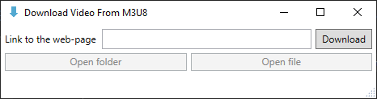
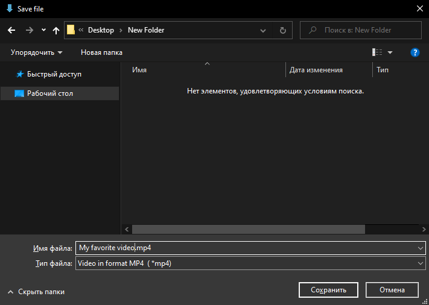
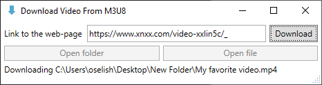
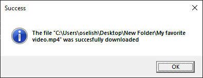
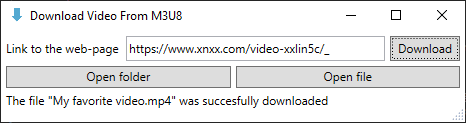

# About

This program allows to download video from HTML page which has link to **.m3u8 playlist** but hasn't any other links to video.

### Before starting

This repository is Visual Studio 2022 v17.7.3 WPF-project. Before launch program you need to:

1. Compile this project;
2. Download **FFmpeg** from [BtbN's github repository](https://github.com/BtbN/FFmpeg-Builds/releases/download/latest/ffmpeg-master-latest-win64-gpl.zip) and unpack the downloaded archive to the folder with "Download Video From M3U8.exe". The **"2023-09-22 12:51 Auto-Build"** is recomended. The folder with program should look something like this:

📁Download Video From M3U8 
├📁ffmpeg-master-latest-win64-gpl 
│├📁bin 
││├📃ffmpeg.exe 
││├📃ffplay.exe 
││└📃ffprobe.exe 
│├📁doc 
││├📃bootstrap.min.css 
││├📃community.html 
││├📃default.css 
││├📃developer.html 
││├📃faq.html 
││├📃fate.html 
││├📃ffmpeg-all.html 
││├📃ffmpeg-bitstream-filters.html 
││├📃ffmpeg-codecs.html 
││├📃ffmpeg-devices.html 
││├📃ffmpeg-filters.html 
││├📃ffmpeg-formats.html 
││├📃ffmpeg-protocols.html 
││├📃ffmpeg-resampler.html 
││├📃ffmpeg-scaler.html 
││├📃ffmpeg-utils.html 
││├📃ffmpeg.html 
││├📃ffplay-all.html 
││├📃ffplay.html 
││├📃ffprobe-all.html 
││├📃ffprobe.html 
││├📃general.html 
││├📃git-howto.html 
││├📃libavcodec.html 
││├📃libavdevice.html 
││├📃libavfilter.html 
││├📃libavformat.html 
││├📃libavutil.html 
││├📃libswresample.html 
││├📃libswscale.html 
││├📃mailing-list-faq.html 
││├📃nut.html 
││├📃platform.html 
││└📃style.min.css 
│└📃LICENSE.txt 
├📃Download Video From M3U8.exe 
├📃Download Video From M3U8.exe.config 
├📃Download Video From M3U8.pdb 
├📃System.Buffers.dll 
├📃System.Buffers.xml 
├📃System.Memory.dll 
├📃System.Memory.xml 
├📃System.Numerics.Vectors.dll 
├📃System.Numerics.Vectors.xml 
├📃System.Runtime.CompilerServices.Unsafe.dll 
├📃System.Runtime.CompilerServices.Unsafe.xml 
├📃System.Text.Encoding.CodePages.dll 
└📃System.Text.Encoding.CodePages.xml 

# Getting started

1. Input link to the HTML web page.

    

2. Choose folder for file.

    

3. The download has started.

    

4. When the download is completed you will see this pop-up window.

    

5. Now you can open folder with downloaded file or open file by clicking the appropriate buttons.

    
