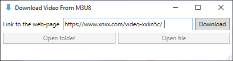

# About

This program allows to download video from HTML page which has link to **.m3u8 playlist** but hasn't any other links to video.

### Before starting

This repository is Visual Studio 2022 v17.7.3 WPF-project. Before launch program you need to:

1. Compile this project;
2. Download **FFmpeg** from [BtbN's github repository](https://github.com/BtbN/FFmpeg-Builds/releases/download/latest/ffmpeg-master-latest-win64-gpl.zip) and unpack the downloaded archive to the folder with "Download Video From M3U8.exe". The **"2023-09-22 12:51 Auto-Build"** is recomended. The folder with program should look something like this:

沒．ownload Video From M3U8 
笏懺沒’fmpeg-master-latest-win64-gpl 
笏や莫沒｜in 
笏や狽笏懺沒デfmpeg.exe 
笏や狽笏懺沒デfplay.exe 
笏や狽笏避沒デfprobe.exe 
笏や莫沒‥oc 
笏や狽笏懺沒ッootstrap.min.css 
笏や狽笏懺沒ツommunity.html 
笏や狽笏懺沒ヅefault.css 
笏や狽笏懺沒ヅeveloper.html 
笏や狽笏懺沒デaq.html 
笏や狽笏懺沒デate.html 
笏や狽笏懺沒デfmpeg-all.html 
笏や狽笏懺沒デfmpeg-bitstream-filters.html 
笏や狽笏懺沒デfmpeg-codecs.html 
笏や狽笏懺沒デfmpeg-devices.html 
笏や狽笏懺沒デfmpeg-filters.html 
笏や狽笏懺沒デfmpeg-formats.html 
笏や狽笏懺沒デfmpeg-protocols.html 
笏や狽笏懺沒デfmpeg-resampler.html 
笏や狽笏懺沒デfmpeg-scaler.html 
笏や狽笏懺沒デfmpeg-utils.html 
笏や狽笏懺沒デfmpeg.html 
笏や狽笏懺沒デfplay-all.html 
笏や狽笏懺沒デfplay.html 
笏や狽笏懺沒デfprobe-all.html 
笏や狽笏懺沒デfprobe.html 
笏や狽笏懺沒トeneral.html 
笏や狽笏懺沒トit-howto.html 
笏や狽笏懺沒ネibavcodec.html 
笏や狽笏懺沒ネibavdevice.html 
笏や狽笏懺沒ネibavfilter.html 
笏や狽笏懺沒ネibavformat.html 
笏や狽笏懺沒ネibavutil.html 
笏や狽笏懺沒ネibswresample.html 
笏や狽笏懺沒ネibswscale.html 
笏や狽笏懺沒ノailing-list-faq.html 
笏や狽笏懺沒ハut.html 
笏や狽笏懺沒パlatform.html 
笏や狽笏避沒ピtyle.min.css 
笏や粕沒キICENSE.txt 
笏懺沒ゥownload Video From M3U8.exe 
笏懺沒ゥownload Video From M3U8.exe.config 
笏懺沒ゥownload Video From M3U8.pdb 
笏懺沒ゴystem.Buffers.dll 
笏懺沒ゴystem.Buffers.xml 
笏懺沒ゴystem.Memory.dll 
笏懺沒ゴystem.Memory.xml 
笏懺沒ゴystem.Numerics.Vectors.dll 
笏懺沒ゴystem.Numerics.Vectors.xml 
笏懺沒ゴystem.Runtime.CompilerServices.Unsafe.dll 
笏懺沒ゴystem.Runtime.CompilerServices.Unsafe.xml 
笏懺沒ゴystem.Text.Encoding.CodePages.dll 
笏避沒ゴystem.Text.Encoding.CodePages.xml 

# Getting started

1. Input link to the HTML web page.

    

2. Choose folder for file.

    

3. The download has started.

    

4. When the download is completed you will see this pop-up window.

    

5. Now you can open folder with downloaded file or open file by clicking the appropriate buttons.

    
